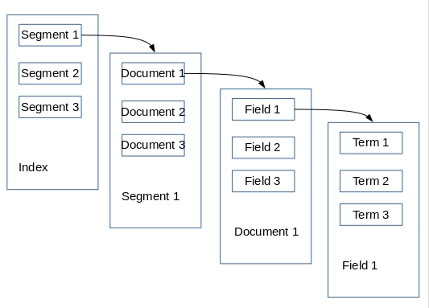
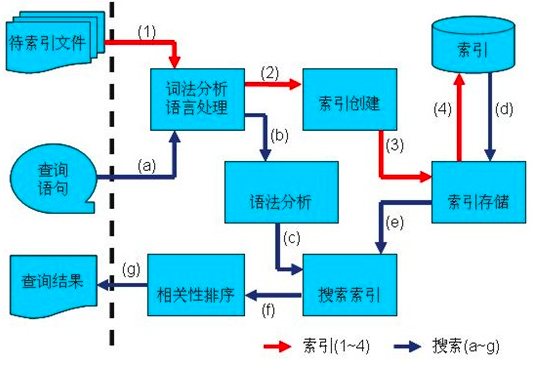
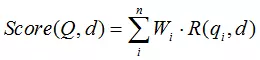
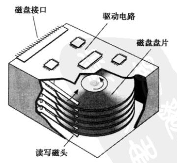
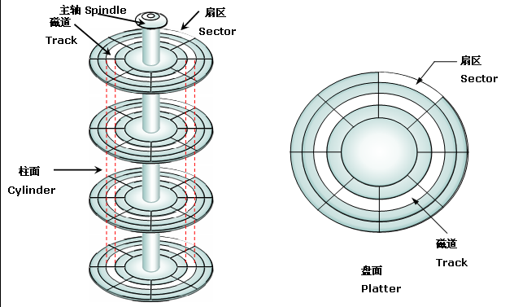
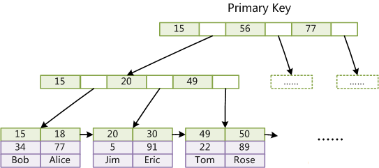
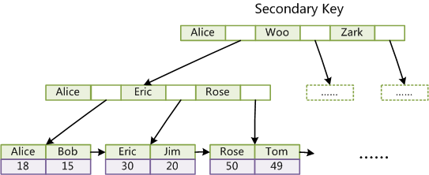
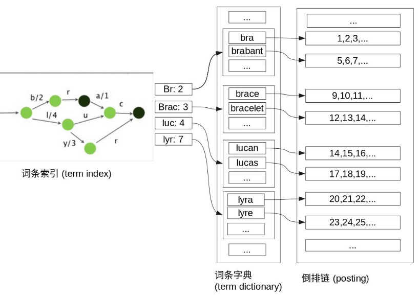
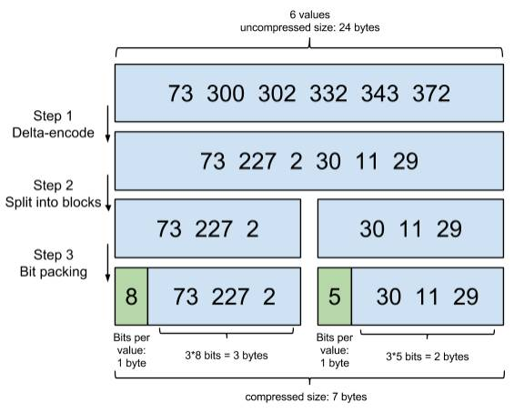
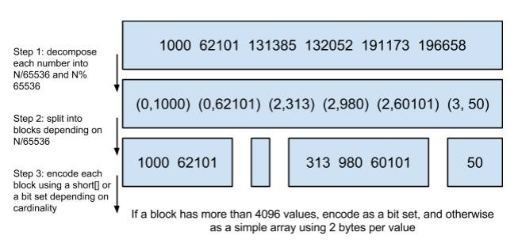

搜索引擎原理

# 概念

目前比较知名的开源搜索引擎有es和solr，es很早的版本就提供聚合统计的功能，它的母公司开发了一套完整的提取转换、搜索、展现的工具链ELK(elasicsearch, lostash, kibana)，很多小公司拿来做bi或者日志分析。es和solr底层都是基于lucene,，所以本文讨论的搜索引擎是以lucene作为原型。

- 索引(Index):  
    索引（名词），一个 索引 类似于传统关系数据库中的一个 数据库 ，是一个存储文档的地方。 索引的复数词为 indices 或 indexes 。  
    索引（动词），就是存储文档以便被检索和查询。这非常类似于 SQL 语句中的 INSERT 关键词。
    
- 段(Segment)  
    一个索引(indices)会由一个或多个子索引构成，子索引被称为段(Segment)。
    
- 文档(Document)：  
    包含**键值对**的文本，编程上术语上的 JSON 对象。一个 键 是一个字符串，一个 值 可以是一个字符串，一个数字，一个布尔值， 另一个对象，一些数组值，或一些其它特殊类型诸如表示日期的字符串，或代表一个地理位置的对象。在大多数应用中，多数实体或对象可以被序列化为JSON 对象。一个索引(indices)内会包含多个文档。
    

    ```
    {
        "字段名称1": "字符串值",
        "字段名称2": 10000,
        "字段名称3": "2020-01-01 00:00:00",
        "字段名称4": {
            "字段名称5": [113.0, 23.0]
        }
    }

    ```

- 文档ID(DocId):  
    每一个文档在搜索引擎内部都有一个唯一的标识，称为docId，通常在创建索引阶段由搜索引擎生成并绑定在文档上。
    
- 字段(Field)：  
    即是上述文档中的键值对。一个文档会由一个或多个字段组成，字段是搜索引擎中数据索引的最小**定义单位**。通常搜索引擎提供多种不同类型的字段，例如StringField、TextField、LongFiled或NumericDocValuesField等，根据类型来判断该字段值要采用哪种类型的保存方式，类似于数据库的schema。**下文开始，为了简洁，如非特别说明，提到的文档都是只有一个字段，字段类型是字符型，而且省略字段名。**
    
- 词条(term)和词条字典(Term Dictionary):  
    词条是搜索引擎中**索引和搜索**的最小单位，一个字段会由一个或多个词条组成，词条是由字段值经过分析处理器（分词）产生的。词条词典，是根据条件查找词条的基本索引。
    
- 正排索引(forward-index) 和 反排索引(inverted-index):  
    正排索引本质上是由文档和单词组成的成对的列表，例如，有両个文档
    

    1.  有限公司
    2.  集团公司  
        正排索引看上大概是这样的:

    | 文档ID | 词条  |
    | --- | --- |
    | 1   | 有限,公司 |
    | 2   | 集团,公司 |

    倒排索引由文档中所有不重复词的列表构成，对于其中每个词，有一个包含它的文档的列表。  
    反排索引看上去是这样的：

    | 词条  | 文档ID |
    | --- | --- |
    | 有限  | 1   |
    | 集团  | 2   |
    | 公司  | 1,2 |

默认的，一个文档中的每一个属性都是 被索引 的（有一个倒排索引）和可搜索的。一个没有倒排索引的属性是不能被搜索到的。

  
图1: 搜索引擎存储层级结构

# 整体流程
  
图2: 整体流程

要对文档进行搜索，需要先对文档进行索引。索引过程中，文档中的每个待索引字段都需要经过分析程序处理，这一步得到每个索引字段的正排索引，再通过正排索引生成每个索引字段的倒排索引。  
搜索时，搜索条件中的每个字段值同样需要经过分析程序处理，然后通过词条找到文档列表，取交集或并集，计算相关性得分，排序，最后返回结果给用户。

我们看一个具体的例子，以人名、年龄、学号为例，如何实现查某个名字（有重名）。

| 文档ID | name | age | number |
| --- | --- | --- | --- |
| 1   | 张三  | 18  | 100 |
| 2   | 张三  | 20  | 101 |
| 3   | 李四  | 21  | 102 |

为了查询name=XXX的这样一个条件，需要建立基于name的倒排索引。上面的数据为例，倒排索引如下。

| 词条  | 文档ID |
| --- | --- |
| 张三  | 1, 2 |
| 李四  | 3   |

如果我们还希望按年龄查找，例如想查age=18的列表，还需要建立另一个倒排索引：

| 词条  | 文档ID |
| --- | --- |
| 18  | 1   |
| 20  | 2   |
| 21  | 3   |

搜索name=张三，得到\[1,2\], 搜索age=18，得到\[1\]，取交集得到\[1\]。同理通过取并集可以支持更复杂的查询。

### 词法分析

接下来，我们看下分析程序怎样生成词条的。分析包含下面的过程：

- 首先，分词，将一块文本分成适合于倒排索引的独立的词条(term)
- 之后，词项处理，将这些词条统一化为标准格式以提高它们的“可搜索性”

分词的正确性非常重要，分词粒度太大，搜索命中率就会偏低，分词粒度太小，准确率就会降低。如何恰到好处的分词，是搜索引擎需要做的第一步。中文分词比较知名的开源实现有，IK分词。

- 正确性&粒度  
    分词正确性:  
    “他说的确实在理”，这句话如何分词？  
    “他-说-的确-实在-理” （错误语义）  
    “他-说-的-确实-在理” （正确语义）  
    分词的粒度:  
    “中华人民共和国宪法”，这句话如何分词？  
    “中华人民共和国-宪法”，（搜索 中华、共和国 无结果）  
    “中华-人民-共和国-宪法”，（搜索 共和 无结果）  
    “中-华-人-民-共-和-国-宪-法”，（搜索其中任意字都有结果）  
    分词的粒度并不是越小越好，它会降低准确率，比如搜索 “中秋” 也会出现上面的文档（命中“中”），而且粒度越小，索引词典越大，搜索效率也会下降。
    
- 停用词  
    很多语句中的词都是没有意义的，比如 “的”，“在” 等副词、谓词，英文中的 “a”，“an”，“the”，这些词叫停用词 (StopWord)，在搜索是无任何意义的，所以在分词时都会去除，降低不必要的索引空间，减少对评分的影响。通常可以通过文档集频率和维护停用词表的方式来判断停用词。
    

词项处理，是指在原本的词项上在做一些额外的处理，比如归一化、词形归并、词干还原等操作，以提高搜索的效果。

- 归一化  
    USA - U.S.A. （缩写)  
    7月30日 - 7/30 (中英文)  
    color - colour (通假词)  
    开心 \- 高兴 (同义词扩展)  
    这样查询 U.S.A. 也能得到 USA 的结果，同义词可以算作归一化处理。
    
- 词形归并（Lemmatization）  
    针对英语同一个词有不同的形态，可以做词形归并成一个，如：  
    am, are, is -> be  
    car, cars, car's, cars' -> car  
    the boy's cars are different colors -> the boy car be different color
    
- 词干还原（Stemming）  
    通常指的就粗略的去除单词两端词缀的启发式过程  
    automate(s), automatic, automation -> automat.  
    高高兴兴 -\> 高兴 (中文重叠词还原)  
    明明白白 -\> 明白  
    英文的常见词干还原算法，Porter算法。
    

### 搜索结果排序

如果只是简单的能搜索出文档还是不够的，例如，上面的例子中，我们想搜“中秋”，结果出来“中华人民共和国”，还排第一位，而我们想搜的“中秋”的文档却要翻好多页才看到，这种搜索引擎是无多大用处的。google之所以强大，就是因为它有一套好的评分算法。抛开google的page rank算法不说，业界有许多公开的评分算法，知名的有BM25，通常是根据关键字和文档的相关性得分排序。计分过程也可以进行人工干预设置权重，称为 boost，创建索引时的干预称为index boost，搜索时的干预称为query boost。

#### TF-IDF

TF(词频)-IDF(逆文档频率)，通过它可以知道某个关键字在这篇文档里的重要程度。其中 TF 表示某个 词条 在 文档 里出现的频次，越高说明越重要；DF（文档频率） 表示在全部 文档 里，共有多少个 文档 出现了这个词，DF 越大，说明这个词很常见，并不重要，越小反而说明他越重要，IDF 是 DF 的倒数(取log)， IDF 越大，表示这个词越重要。  
TF-IDF 怎么影响搜索排序，举一个实际例子来解释：  
假定现在有一篇博客《Blink 实战总结》，我们要统计这篇文章的关键字，首先是对文章分词统计词频，出现次数最多的词是"的"、"是"、"在"，这些是“停用词”，基本上在所有的文章里都会出现，他对找到结果毫无帮助，全部过滤掉。  
只考虑剩下的有实际意义的词，如果文章中词频数关系： “Blink” > “实战” = “总结”，那么肯定是 Blink 是这篇文章更重要的关键字。但又会遇到了另一个问题，如果发现 "Blink"、"实战"、"总结"这三个词的出现次数一样多。这是不是意味着，作为关键词，它们的重要性是一样的？不是的，通过统计全部博客，你发现 含关键字总博客数： “Blink” < “实战” < “总结”，这时候说明 “Blink” 不怎么常见，一旦出现，一定相比 “实战” 和 “总结”，对这篇文章的重要性更大。

#### BM25

上面解释了 TF 和 IDF，那么 TF 和 IDF 谁更重要呢，怎么计算最终的相关性得分呢？那就是 BM25。

BM25算法，通常用来作搜索相关性平分。一句话概况其主要思想：对Query进行解析，生成词条qi；然后，对于每个搜索结果d，计算每个词条qi与d的相关性得分，最后，将qi相对于d的相关性得分进行加权求和，从而得到Query与d的相关性得分。 BM25算法的一般性公式如下：



其中，Q表示Query，qi表示Q解析之后的一个词条；d表示一个搜索结果文档；Wi表示语素qi的权重；R(qi，d)表示语素qi与文档d的相关性得分。

到此，搜索引擎的原理算是讲完了。搜索引擎通常要处理海量数据，但是还是可以近实时地进行搜索（从索引到可搜索的时间花费在1秒内），它为什么能这么快呢？MySQL的MyISAM引擎也可以进行全文搜索，为什么要新做一套，而不是在MyISAM上进行扩展呢？为了回答这些问题，我们继续深入了解搜索引擎的内部实现。

# 主存储

计算机硬件性能在过去十年间的发展普遍遵循摩尔定律,通用计算机的CPU主频早已超过3GHz,内存也进入了普及DDR4的时代。然而传统硬盘虽然在存储容量上增长迅速,但是在读写性能上并无明显提升,同时SSD硬盘价格高昂,不能在短时间内完全替代传统硬盘。接下来，介绍硬盘的物理结构和性能指标,然后讨论下基于磁盘I/O特性设计的优化技巧。

硬盘内部主要部件为磁盘盘片、传动手臂、读写磁头和主轴马达。实际数据都是写在盘片上,读写主要是通过传动手臂上的读写磁头来完成。实际运行时,主轴让磁盘盘片转动,然后传动手臂伸展让读取头在盘片上进行读写操作。磁盘物理结构如下图所示:  
  
图3：磁盘结构

影响磁盘的关键因素是磁盘服务时间,即磁盘完成一个I/O请求所花费的时间,它由寻道时间、旋转延迟和数据传输时间三部分构成。

1.  寻道时间(Tseek)  
    是指将读写磁头移动至正确的磁道上所需要的时间。寻道时间越短,I/O操作越快,目前磁盘的平均寻道时间一般在3-15ms。
    
2.  旋转延迟(Trotation)  
    是指盘片旋转将请求数据所在的扇区移动到读写磁盘下方所需要的时间。旋转延迟取决于磁盘转速,通常用磁盘旋转一周所需时间的1/2表示。比如:7200rpm的磁盘平均旋转延迟大约为60*1000/7200/2 = 4.17ms,而转速为15000rpm的磁盘其平均旋转延迟为2ms。
    
3.  数据传输时间(Ttransfer)  
    是指完成传输所请求的数据所需要的时间,它取决于数据传输率,其值等于数据大小除以数据传输率。目前IDE/ATA能达到133MB/s,SATA II可达到300MB/s的接口数据传输率,数据传输时间通常远小于前两部分消耗时间。简单计算时可忽略。
    

  
图3－1：磁盘图解

**机械磁盘的连续读写性能很好,但随机读写性能很差,** 这主要是因为磁头移动到正确的磁道上需要时间,随机读写时,磁头需要不停的移动,时间都浪费在了磁头寻址上,所以性能不高。

衡量磁盘的重要主要指标是IOPS和吞吐量。

1.  IOPS(Input/Output Per Second)  
    即每秒的输入输出量(或读写次数),即指每秒内系统能处理的I/O请求数量。随机读写频繁的应用,如小文件存储等,关注随机读写性能,IOPS是关键衡量指标。可以推算出磁盘的IOPS = 1000ms / (Tseek + Trotation + Transfer),如果忽略数据传输时间,理论上可以计算出随机读写最大的IOPS。常见磁盘的随机读写最大IOPS为:  
    7200rpm的磁盘 IOPS = 76 IOPS  
    10000rpm的磁盘IOPS = 111 IOPS  
    15000rpm的磁盘IOPS = 166 IOPS
2.  吞吐量(Throughput)  
    指单位时间内可以成功传输的数据数量。顺序读写频繁的应用,如视频点播,关注连续读写性能、数据吞吐量是关键衡量指标。它主要取决于磁盘阵列的架构,通道的大小以及磁盘的个数。不同的磁盘阵列存在不同的架构,但他们都有自己的内部带宽,一般情况下,内部带宽都设计足够充足,不会存在瓶颈。磁盘阵列与服务器之间的数据通道对吞吐量影响很大,比如一个2Gbps的光纤通道,其所能支撑的最大流量仅为250MB/s。最后,当前面的瓶颈都不再存在时,硬盘越多的情况下吞吐量越大。

##### 基于磁盘IO特性的优化技巧

优化背后的主要思想：减少随机读写，把随机读写转为顺序读写。

- 缓存(cache)  
    Cache有两大功能:预读和回写。
    
    1.  预读其实就是利用了局部性原理,具体过程是:对于每个文件的第一个读请求,系统读入所请求的页面并读入紧随其后的少数几个页面(通常是三个页面),这时的预读称为同步预读。对于第二次读请求,如果所读页面不在Cache中,即不在前次预读的页中,则表明文件访问不是顺序访问,系统继续采用同步预读;如果所读页面在Cache中,则表明前次预命中,操作系统把预读页的大小扩大一倍,此时预读过程是异步的,应用程序可以不等预读完成即可返回,只要后台慢慢读页面即可,这时的预读称为异步预读。任何接下来的读请求都会处于两种情况之一:第一种情况是所请求的页面处于预读的页面中,这时继续进行异步预读;第二种情况是所请求的页面处于预读页面之外,这时系统就要进行同步预读。
    2.  回写是通过暂时将数据存在Cache里,然后统一异步写到磁盘中。通过这种异步的数据I/O模式解决了程序中的计算速度和数据存储速度不匹配的鸿沟,减少了访问底层存储介质的次数,使储系统的性能大大提高。
- 排序合并IO请求  
    基本思想就是通过合并和排序I/O请求队列中的请求,以此大大降低所需的磁盘寻道时间,从而提高整体I/O性能。
    
- 文件合并  
    小文件合并为大文件后,首先减少了大量元数据,提高了元数据的检索和查询效率,降低了文件读写的I/O操作延时。其次将可能连续访问的小文件一同合并存储,增加了文件之间的局部性,将原本小文件间的随机访问变为了顺序访问,大大提高了性能。同时,合并存储能够有效的减少小文件存储时所产生的磁盘碎片问题,提高了磁盘的利用率。
    
- 采用追加写  
    把磁盘当作一个巨大的日志文件，只往里面按顺序追加内容，不修改之前的内容。
    
# 内部数据结构的算法
### 平衡树(B tree)

目前大部分数据库系统及文件系统都采用B-Tree或其变种B+Tree作为索引结构，MyISAM的索引结构如下图所示:  
  
图4：非聚集索引B Tree  
MyISAM表的索引和数据是分离的，这种索引方式也叫做“非聚集”的，之所以这么称呼是为了与InnoDB的聚集索引区分。

虽然InnoDB也使用B Tree作为索引结构，具体实现方式却与MyISAM截然不同。  
  
图5：聚集索引B+ Tree  
上图是InnoDB主索引（同时也是数据文件）的示意图，可以看到叶节点包含了完整的数据记录，并且在B Tree的每个叶子节点增加一个指向相邻叶子节点的指针，就形成了带有顺序访问指针的B+Tree。做这个优化的目的是为了提高区间访问的性能，例如图5中如果要查询key为从18到49的所有数据记录，当找到18后，只需顺着节点和指针顺序遍历就可以一次性访问到所有数据节点，极大提到了区间查询效率（不需要多次读取索引定位数据）。这种索引叫做聚集索引。

因为InnoDB的数据文件本身要按主键聚集，所以InnoDB要求表必须有主键（MyISAM可以没有），如果没有显式指定，则MySQL系统会自动选择一个可以唯一标识数据记录的列作为主键，如果不存在这种列，则MySQL自动为InnoDB表生成一个隐含字段作为主键，这个字段长度为6个字节，类型为长整形。

聚集索引这种实现方式使得按主键的搜索十分高效，但是辅助索引搜索需要检索两遍索引：首先检索辅助索引获得主键，然后用主键到主索引中检索获得记录。  
  
图5：辅助索引

了解不同存储引擎的索引实现方式对于正确使用和优化索引都非常有帮助，例如知道了InnoDB的索引实现后，就很容易明白为什么不建议使用过长的字段作为主键，因为所有辅助索引都引用主索引，过长的主索引会令辅助索引变得过大。再例如，用非单调的字段作为主键在InnoDB中不是个好主意，因为InnoDB数据文件本身是一颗B+Tree，非单调的主键会造成在插入新记录时，数据文件为了维持B+Tree的特性而频繁的分裂调整，MySQL不得不为了将新记录插到合适位置而移动数据，甚至目标页面可能已经被回写到磁盘上而从缓存中清掉，此时又要从磁盘上读回来，这增加了很多开销，同时频繁的移动、分页操作造成了大量的碎片，得到了不够紧凑的索引结构，十分低效。因此，使用自增字段作为主键则是一个很好的选择。

一般使用磁盘I/O次数评价索引结构的优劣。先从B-Tree分析，根据B-Tree的定义，可知检索一次最多需要访问h个节点。数据库系统的设计者巧妙利用了磁盘预读原理，将一个节点的大小设为等于一个页，这样每个节点只需要一次I/O就可以完全载入。为了达到这个目的，在实际实现B-Tree还需要使用如下技巧：  
每次新建节点时，直接申请一个页的空间，这样就保证一个节点物理上也存储在一个页里，加之计算机存储分配都是按页对齐的，就实现了一个node只需一次I/O。

B-Tree中一次检索最多需要h-1次I/O（根节点常驻内存），渐进复杂度为O(h)=O(logdN)。一般实际应用中，出度d是非常大的数字，通常超过100，因此h非常小（通常不超过3）。

综上所述，用B-Tree作为索引结构效率是非常高的。

### 日志结构合并树(Log Structure-Merge tree, LSM)

LSM (Log Structured Merge Tree)，最早是谷歌的 “BigTable” 提出来的，目标是保证写入性能，同时又能支持较高效率的检索，在很多 NoSQL 中都有使用，搜索引擎也是使用 LSM 思想来写入。

普通的B+树增加记录可能需要执行 seek+update 操作，这需要大量磁盘寻道移动磁头。而 LSM 采用记录在文件末尾，顺序写入减少移动磁头/寻道，执行效率高于 B+树。具体 LSM 的原理是什么呢？

为了保持磁盘的IO效率，搜索引擎避免对索引文件的直接修改，所有的索引文件一旦生成，就是只读，不能被改变的。其操作过程如下：

- 在内存中保存新增的索引;
- 内存中的索引数量达到一定阈值时，触发写操作，将这部分数据批量写入新文件，我们称为segment;
- 新增的segment生成后，不能被修改；
- update操作和delete操作不会立即导致原有的数据被修改或者删除，会以append的方式存储update和delete标记;
- 最终得到大量的 segment，为了减少资源占用，也提高检索效率，会定期的将这些小的 segment 合并成大的 segment，由于segment中的数据都是排好序的，所以合并也不会有随机写操作；
- 通过merge，还可以把update和delete操作真正生效，删除多余的数据，节省空间。

Segment在被flush或commit之前，数据保存在内存中，是不可被搜索的，这也就是为什么Lucene被称为提供近实时而非实时查询的原因。

### 有限状态转换器(Finite State Transducer， FST)

上文说到，搜索引擎实现快速搜索的核心就是倒排索引。  
  
图6：FST与倒排索引  
有了词条字典之后，可以按B树的方式组织，以 logN 次磁盘查找得到倒排链。但是磁盘的随机读操作仍然是非常昂贵的。所以尽量少的读磁盘，有必要把一些数据缓存到内存里。但是整个词条字典引本身又太大了，无法完整地放到内存里。于是就有了词条索引(term index)。词条索引有点像一本字典的大的章节表。比如：  
A开头的词条 ……………. Xxx页  
C开头的词条 ……………. Xxx页  
E开头的词条 ……………. Xxx页

实际的词条索引是一棵树,这棵树不会包含所有的词条，它包含的是词条的一些前缀。通过词条索引可以快速地定位到词条字典的位置，然后从这个位置再往后顺序查找。

所以词条索引不需要存下所有的词条，而仅仅是他们的一些前缀与词条字典的数据块之间的映射关系，再结合压缩技术，可以使词条索引缓存到内存中。

另外，词条字典在磁盘上是以分数据块的方式保存的，一个数据块内部利用公共前缀压缩，比如都是Ab开头的单词就可以把Ab省去。这样词条字典可以更节约磁盘空间。

### 压缩技术

对词条索引应用的压缩技巧，对倒排链也同样适用。

- Frame Of Reference

增量编码压缩，将大数变小数，按字节存储。倒排链是有序的，这样做的一个好处是方便压缩，看下面这个图例：  
  
图7：Frame Of Reference  
通过增量，将原来的大数变成小数仅存储增量值，再精打细算按bit排好队，最后通过字节存储，而不是尽管是2也用int(4个字节)来存储。

- Roring Bitmaps  
    说到Roaring bitmaps，就必须先从位图(bitmap)说起。位图是一种数据结构，假设有某个倒排链：

\[1,3,4,7,10\]

对应的bitmap就是：

\[1,0,1,1,0,0,1,0,0,1\]

非常直观，用0/1表示某个值是否存在，比如10这个值就对应第10位，对应的bit值是1，这样用一个字节就可以代表8个文档id，旧版本(5.0之前)的Lucene就是用这样的方式来压缩的，但这样的压缩方式仍然不够高效，如果有1亿个文档，那么需要12.5MB的存储空间，这仅仅是对应一个索引字段(我们往往会有很多个索引字段)。于是有人想出了Roaring bitmaps这样更高效的数据结构。

将倒排链按照65535为界限分块，比如第一块所包含的文档id范围在0 ~ 65535之间，第二块的id范围是65536 ~ 131071，以此类推。再用&lt;商，余数&gt;的组合表示每一组id，这样每组里的id范围都在0 ~ 65535内了，剩下的就好办了，既然每组id不会变得无限大，那么我们就可以通过最有效的方式对这里的id存储。  
  
图8：Roaing Bitmaps

### 跳表(Skip List)

要联合使用多个索引，有两种办法：位图和跳表。跳表是一种高效的链表结构，在查询、添加、删除的时间复杂度上做到O(logN)。数据结构如下图：  


查询的过程很简单，从顶层开始，往后查询遇到节点的next()比待查的大或者到NIL了，节点不变下移一层继续向后查询，如此反复，直到到了底层还没查到。

对于一个很长的倒排链，我们可以构建它的跳表结构，比如：  
\[1,3,13,101,105,108,255,256,257\]，  
我们可以把这条链分成三个数据块：  
\[1,3,13\] \[101,105,108\] \[255,256,257\]  
然后可以构建出跳表的第二层：  
\[1,101,255\]  
1,101,255分别指向自己对应的数据块，数据块内按同样的方式可以继续构建下层。这样就可以很快地跨数据块的移动指向位置了。搜索引擎自然会对数据块再次进行压缩。其压缩方式是上文提到的Frame Of Reference。补充一点的是，利用skip list，除了跳过了遍历的成本，也跳过了解压缩这些压缩过的数据块的过程，从而节省了cpu。

对于mysql来说，如果你给多个字段都建立了索引，查询的时候只会选择其中最稀疏的来用，然后另外的条件是在遍历行的过程中在内存中计算之后过滤掉。

现在我们可以回答“为什么搜索引擎检索可以比MySQL快”了。Mysql只有词条字典这一层，是以树的方式存储在磁盘上的。检索一个词条需要若干次的随机读的磁盘操作。而搜索引擎在词条字典的基础上添加了词条索引来加速检索，词条索引以树的形式缓存在内存中。从词条索引查到对应的词条字典的数据块位置之后，再去磁盘上找词条，大大减少了磁盘的随机读次数。而且MySQL原地更新的方式会有更多随机读写以及不紧凑的索引文件，而搜索引擎通过LSM，减少了随机读写，索引文件更紧凑。在利用索引的方式上，搜索引擎可以高效利用多个索引，MySQL不能。

搜索引擎就是尽量将磁盘里的东西搬进内存，减少磁盘随机读取次数，结合各种压缩算法，高效使用内存，从而达到快速搜索的特性。还有些特性没有介绍，例如docValue，对聚合统计十分重要，有兴趣的可以查看下面的关于时间序列数据库的参考资料。

# 参考资料

- [https://yq.aliyun.com/articles/702381](https://yq.aliyun.com/articles/702381)  
    分享了搜索引擎的一系列核心数据结构和算法，覆盖搜索引擎的核心原理。
    
- [http://vlambda.com/wz_wvS2uI5VRn.html](http://vlambda.com/wz_wvS2uI5VRn.html)  
    分析了ElasticSearch比MySQL快的原因
    
- [https://www.kancloud.cn/kancloud/theory-of-mysql-index/41846](https://www.kancloud.cn/kancloud/theory-of-mysql-index/41846)  
    讨论了MySQL索引背后的数据结构和算法基础。
    
- [https://tech.meituan.com/2017/05/19/about-desk-io.html](https://tech.meituan.com/2017/05/19/about-desk-io.html)  
    介绍硬盘的物理结构和性能指标，以及操作系统针对磁盘性能所做的优化，最后讨论基于磁盘I/O特性设计的技巧。
    
- [https://www.shenyanchao.cn/blog/2018/12/04/lucene-fst/](https://www.shenyanchao.cn/blog/2018/12/04/lucene-fst/)  
    由浅入深地介绍了FST(Finite State Transducer)的原理。
    
- [http://blog.mikemccandless.com/2011/02/visualizing-lucenes-segment-merges.html](http://blog.mikemccandless.com/2011/02/visualizing-lucenes-segment-merges.html)  
    可视化地展示了搜索引擎内部合并segment的方式，即是LSM的算法原理，十分直观。
    
- [https://www.infoq.cn/article/database-timestamp-01](https://www.infoq.cn/article/database-timestamp-01)
    
- [https://www.infoq.cn/article/database-timestamp-02](https://www.infoq.cn/article/database-timestamp-02)
    
- [https://www.infoq.cn/article/database-timestamp-03](https://www.infoq.cn/article/database-timestamp-03)  
    分析了市面上的多种时间序列数据库，从底层原理上解释es为什么能成为其中的佼佼者。
    
    
    
  
 本文以《署名-非商业性使用-相同方式共享 4.0 协议 (CC BY-NC-SA 4.0)》授权
